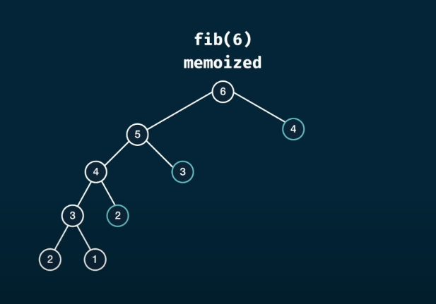

# Dynamic Programing

### Dynamic problem is an algorithm technique based on reccurent formula, it is an algorithm which helps to solve overlapping sub-problems. Sometimes these sub-problems in dp are known as states. A good example of a dp problem is fibonacii series. A good trick or strategy to solve dp questions is to use memoization.
<br>

# Memoization
### Memoization is the strategy where we calculate the states and store them so that we don't have to calculate them again and again because a state can be present in many different parts of the solution of the problem.
<br>

# Fib memoization

As you can see, the time complexity changes from O(2^N) to O(N)
and our HashMap will look something like this
``` 
d{
    3: 2,
    4: 3,
    5: 5
}
```