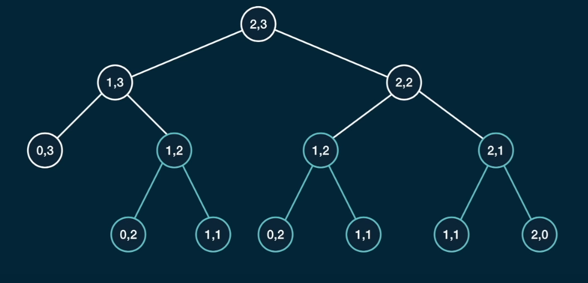

# Dynamic Programing
Dynamic problem is an algorithm technique based on reccurent formula, it is an algorithm which helps to solve overlapping sub-problems. Sometimes these sub-problems in dp are known as states. A good example of a dp problem is fibonacii series. A good trick or strategy to solve dp questions is to use memoization.
<br>

# Memoization
Memoization is the strategy where we calculate the states and store them so that we don't have to calculate them again and again because a state can be present in many different parts of the solution of the problem.
<br>

# Memoization Recipe
1. Make it work.
    * visualize the problem as a tree
    * implement the tree using recursion
    * test it
2. Make it efficient
    * add a memo object 
    * add a base case to return memo values
    * store return values into the memo
<br/>

## Fibonacii memoization
### Q. Write a funtion ```fib(n)``` that takes in a number as arguement. The function should return the n-th number of the fibonacii sequence.
<p align="center">

</p>

As you can see, the time complexity changes from O(2^N) to O(N)
and our HashMap which stores the states will look something like this
``` 
d{
    3: 2,
    4: 3,
    5: 5
}
```
<br/>

## Grid-Traveler Problem <br/>
### Q. Say that you are a traveler on a 2D grid. You begin in the top-left corner and your goal is to travel to the bottom-right corner. You may only move down right or left. In how many ways can you travel to the goal on a grid with dimensions m*n? <br/>
So, the ques can be soved easily with a time-complexity of O(n+m) using the memoization technique. We will store the grids that we have already calculated in a HashMap and use them to calculate the no. of ways of the bigger grids eg. for a  2,3 grid given in the image we can see that there are many grids that are repeating for eg. (1,2) so we can calculate the no. of ways of that grid once and store it in the HashMap. This method brings down the complexity from O(2^(n*m)) to O(n+m).
<p align="center">

</p>

The hashMap will look something like this
```
d{
    "1,2": 1
}
```
<br/>

## CanSum Memoization
### Q. Write a function ```canSum(targeSum, numbers)``` that takes in a targetSum and an array of numbers as arguements.
The function should return boolean indicating true wether or not it is possible to generate the targetSum using numbers from the array. <br/><br/>
You may use an element of the array as many times as needed. <br/><br/>You may assume that all input numbers are non-negative.
