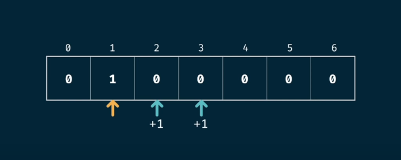
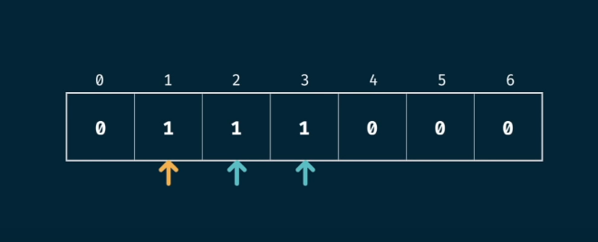
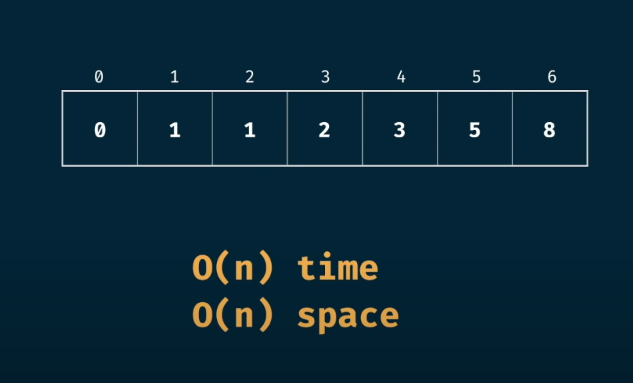
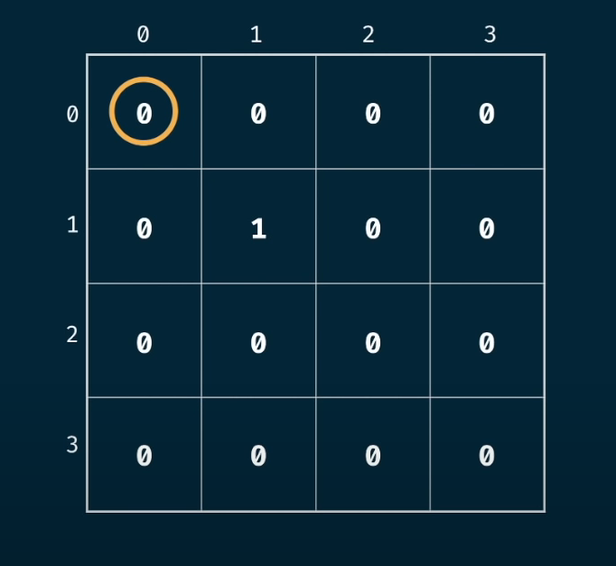
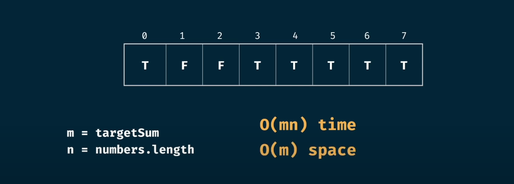

# Tabulation (Bottom Up approach)
Tabulation is the strategy which uses bottom-up approach which transitions from the base case and reaches its destination state the nth state. It uses a table to store all the values uptil nth state.
<br>

# Tabulation Recipe
* visualize the problem as a table
* size the table based on the inputs
* initialize the table with default values
* seed the trivial answer into the table eg. for the grid traveller problem it was 1x1 = 1 and for fibonacii problem it was 0 = 0 and 1 = 1
* iterate throught the table
* fill further positions based on the current positions
<br/>

## Fibonacii tabulation
### Q. Write a funtion ```fib(n)``` that takes in a number as arguement. The function should return the n-th number of the fibonacii sequence.
The code initializes the base cases which is 0 and 1 and the iterates through all the n elements adding the ith value to i+1 element and i+2 element.
<p align="center">

</p>
<p align="center">

</p>
Finally the final table will look something like this
<p align="center">

</p>
<br/>

## Grid-Traveler Problem <br/>
### Q. Say that you are a traveler on a 2D grid. You begin in the top-left corner and your goal is to travel to the bottom-right corner. You may only move down right or left. In how many ways can you travel to the goal on a grid with dimensions m*n? <br/>
So, we need to find how our current position in the table affects the immediate neighbhours right and downward. The time complexity of the code is O(nm) where n and m is the size of the rows and columns.
<p align="center">

</p>
<br/>

## CanSum Memoization
### Q. Write a function ```canSum(targeSum, numbers)``` that takes in a targetSum and an array of numbers as arguements.
The function should return boolean indicating true wether or not it is possible to generate the targetSum using numbers from the array. <br/><br/>
You may use an element of the array as many times as needed. <br/><br/>You may assume that all input numbers are non-negative.

In this ques, we make a N+1 table and initialize all the values of the table to False. We pick the seed value 0 as make it True because you don't need any number to generate 0.
We then check the current pos in the table and if it's true we make the current pos + the number in our list also true.
So our  table initially looks like this

```python
table = [False, False, False ...]
```
Our final table will look like this with complexity of O(mn)
<p align="center">

</p>
<br/>

## HowSum Tabulation
### Q. Write a function ```howSum(howSum, numbers)``` that takes in a targetSum and an array of numbers as arguements.
The function should return an array containing any combination of elemnts that add up to exactly the targetSum. If there is no combination that adds up to the targetSum, then return null.
Here the time-complexity is (n^m)*m.

<br/>

## BestSum Tabulation
### Q. Write a function ```bestSum(howSum, numbers)``` that takes in a targetSum and an array of numbers as arguements.
Time-complexity is (n^m)*m.

<br/>

<!-- ## canConstruct Memoization
### Q. Write a function ```canConstruct(target, a)``` that takes in a target string and an array of strings as arguements.
The function should return boolean indicating true wether or not it is possible to generate the target string using the array of strings.
So the time-complexity of the code without using memoization is O((n^m)*m) and space complexity is O(m^2). After using meoization the time-complexity changes to O((n*m)*m) and space-complexity remains the same.
<br/>

## countConstruct Memoization
### Q. Write a function ```countConstruct(target, a)``` that takes in a target string and an array of strings as arguements.
The function should return the number of ways that the target can be constructed by concatenating elements of the array of elements.
So the time-complexity of the code without using memoization is O((n^m)*m) and space complexity is O(m^2). After using meoization the time-complexity changes to O((n*m)*m) and space-complexity remains the same.
<br/>

## allConstruct Memoization
### Q. Write a function ```allConstruct(target, a)``` that takes in a target string and an array of strings as arguements.
The function should return all the ways that the target can be constructed by concatenating elements of the array of elements.
<p align="center">

</p>
Let m be the height of the tree and n be the no. of elements in the array. So the total no. of combinations will be equal to n^m. So, we'll have n^m sub-arrays as output. So the time-complexity will be O(n^m) and space complexity will be O(m). -->